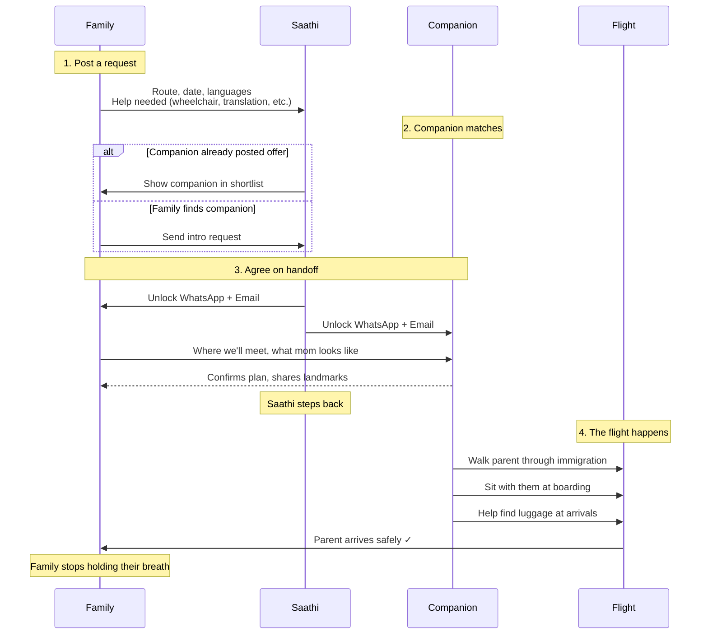
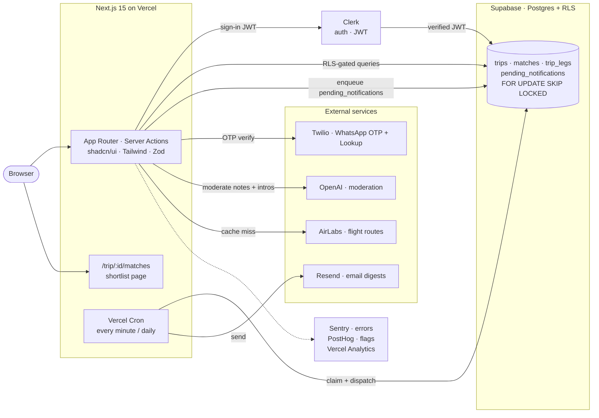

<p align="center">
  
</p>

<div align="center">


# Saathi

**साथी** — _companion · partner · friend on the journey_

**Nobody flies alone.**

The open-source matchmaking platform for cross-border family travel.<br/>

[](https://github.com/raahulrahl/saathi/actions/workflows/ci.yml)
[](https://github.com/raahulrahl/saathi/stargazers)
[](https://github.com/raahulrahl/saathi/network/members)
[](https://github.com/raahulrahl/saathi/issues)
[](https://github.com/raahulrahl/saathi/pulls)
[](https://hits.sh/github.com/raahulrahl/saathi/)
[](LICENSE)
[](https://nextjs.org)
[](https://www.typescriptlang.org)

[Website](https://getsaathi.com) · [Report a bug](https://github.com/raahulrahl/saathi/issues/new) · [Request a feature](https://github.com/raahulrahl/saathi/issues/new) · [Contributing](#contributing)

</div>

## What is Saathi?

Every diaspora family knows the call: a parent flying alone, a long layover, an unfamiliar terminal, a language they only half-speak. We wait for them to message that they've found the gate. We don't sleep until they do.

There are tens of thousands of solo travellers on the same flight, doing nothing in particular for those eight hours. **Saathi puts those two people in touch a few weeks before the flight**, sets up an introduction, and lets the family stop holding their breath at 3 AM.

We don't run the trip. We don't take a cut. We make the introduction, then get out of the way.

<p align="center">
  
</p>

## Features

- **Match by flight leg, not the whole trip** — Someone only flying Doha→Amsterdam can still help with that layover. We're not picky about where they started.
- **Language matters more than everything else** — A Bengali-speaking companion beats a same-day English-only one. Your mom doesn't need someone who can't understand her panic.
- **Just enough verification, not a background check** — WhatsApp OTP + a LinkedIn link. Enough to trust them with your parent, not enough to scare away normal humans.
- **Top 3-5 matches, not Tinder for flights** — We show you the best people for your exact flight. No swiping, no endless scrolling, no "maybe this one?"
- **Private until you say yes** — Contact details stay locked until both sides agree. No creeps sliding into DMs before the match.
- **Smart notifications that don't spam** — Daily digest, not 47 emails. Popular routes won't flood your inbox at 3 AM.

---

## Quick Start

```bash
# 1. Use the pinned Node version (.nvmrc → 20.18.x)
nvm use

# 2. Install
corepack enable
pnpm install

# 3. Copy env and fill in at minimum: Clerk + Supabase keys
cp .env.example .env.local

# 4. Run
pnpm dev    # http://localhost:3000
```

Optional env vars (Sentry, Twilio, PostHog, Resend, AirLabs, OpenAI) are read lazily — features that depend on a missing key disable themselves rather than crash. See [`.env.example`](.env.example) for the full list and what each one unlocks.

---

## How it works



---

## Architecture



_Tooling_: pnpm · Vitest · ESLint · Prettier · Husky · commitlint.

---

## Scripts

| Script                              | What it does                                                |
| ----------------------------------- | ----------------------------------------------------------- |
| `pnpm dev`                          | Next.js dev server                                          |
| `pnpm build`                        | Production build (uploads Sentry source maps if configured) |
| `pnpm lint`                         | ESLint                                                      |
| `pnpm format` / `pnpm format:check` | Prettier write / check                                      |
| `pnpm typecheck`                    | `tsc --noEmit`                                              |
| `pnpm test`                         | Vitest run (`pnpm test:watch` for watch mode)               |
| `pnpm db:types`                     | Regenerate `types/db.ts` from linked Supabase project       |
| `pnpm db:reset`                     | Reset local Supabase + re-apply migrations                  |
| `pnpm db:push`                      | Push pending migrations to remote                           |

---

## Contributing

Saathi is open source and contributions are warmly welcome — code, design, copy edits, translations, bug reports, all of it.

**Before a non-trivial change**, open an issue (or comment on an existing one) so we can sanity-check direction together. Saves wasted work on either side.

Conventions:

- **Trunk-based.** PRs target `main`. No long-lived branches.
- **Conventional Commits.** Enforced by `commitlint` via a Husky `commit-msg` hook.
- **Tests where they matter.** Pure logic (matching, parsing) gets unit tests. UI changes are validated locally.
- **One thing per PR.** Small PRs land faster.

Run the floor before pushing:

```bash
pnpm typecheck && pnpm lint && pnpm test && pnpm build
```

The live code-review + issue tracker lives in [`bugs/`](bugs), and the UX design anchor in [`docs/UX_MATCHMAKING.md`](docs/UX_MATCHMAKING.md).

---

## Star History

<a href="https://www.star-history.com/?repos=raahulrahl%2Fsaathi&type=date">
  <picture>
    <source media="(prefers-color-scheme: dark)" srcset="https://api.star-history.com/svg?repos=raahulrahl/saathi&type=Date&theme=dark" />
    <source media="(prefers-color-scheme: light)" srcset="https://api.star-history.com/svg?repos=raahulrahl/saathi&type=Date" />
    
  </picture>
</a>

---

## License

Apache License 2.0 — see [LICENSE](LICENSE) for the full text. Use, modify, and ship Saathi freely; please keep the copyright and license notice on derivative work.

---

## A note on the name

**Saathi (साथी)** in Hindi, Bengali, Marathi, Punjabi, and several other Indian languages means _companion_, _partner_, _friend on the journey_. It's the word a parent might use for the person who walks them through a confusing terminal.

That's the whole product.
